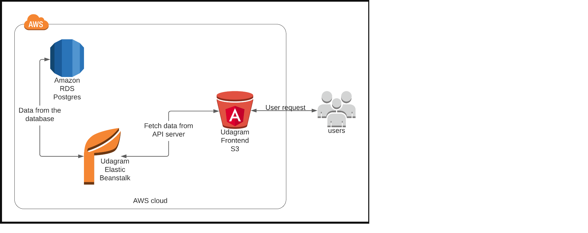

# Infrasctructure Description

## AWS
### RDS Postgres 
- The application server uses AWS RDS Postgres as database for storing and retrieving information.
    + Endpoint: database-1.cnesexmfl5do.us-east-1.rds.amazonaws.com
    + Port: 5432
### Elastic Beanstack
- Used to save BE code and FrontEnd code will call the API's on  the EB through this endpoint.
    + Endpoint: http://Demoapp-env.eba-wnenuhg8.us-east-1.elasticbeanstalk.com
### S3 Bucket
- The frontend application is deployed using AWS S3 Bucket. The bundled assets are uploaded to an S3 bucket and that
bucket is made publicly readable. End users can access the application from the Bucket's endpoint.
    + Endpoint: http://bucket-udagram1715-0387-3812.s3-website-us-east-1.amazonaws.com 