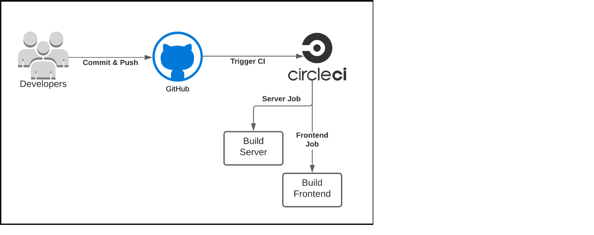

# Pipeline Description


## 1. Connect the Pipeline to Github
1. Create pipeline file in **.cirleci** folder and name it's **config.yml**
2. Create a new repositoty on GitHub then push the project to that repo.
3. Register with CircleCI for a [free account](https://circleci.com/signup/?source-button=free) using your GitHub credentials.
4. Set up a new project in CircleCI dashboard using newly created GitHub repository. Select the existing **.circleci/config.yml** file already present in the repository.
5. Test that the pipeline is working. Commit and push a new change on the repository. This should trigger a pipeline run in the CircleCI UI.
 
**NOTE:** If the Github repo is connected to CircleCI correctly, then the commits/pushes to repo will trigger the CI/CD pipeline automatically.

## 2. Continuous Integration
1. **Update the root package.json**
2. **Update the config.yml:**
    - Add two steps in the pipeline that will install the node dependencies in the **frontend** server and build the UI.
    - Add two steps in the pipeline that will install the node dependencies in the **backend** server and build the UI.
3. **Trigger:** Push the changes to the Github repo. After we push this change to our GitHub repo, CircleCI should trigger and we will have completed a continuous integration step!

## 3. Continuous Delivery and Deployment
1. **Update the S3 bucket name:** In frontend folder. We will need to edit the **.../bin/deploy.sh script** and add the name of our previously used S3 bucket.
    ```typescript
    # Replace the [udagram-test01] below with the S3 bucket name
    aws s3 cp --recursive --acl public-read ./build s3://[udagram-test01]/
    # The trailing / at the end of the URL is important. 
    ```
2. **Update the frontend package.json** - add a new "deploy" script. The "scripts" section will look like this:
    ```typescript
    "scripts": {
        "start": "react-scripts start",
        "build": "react-scripts build",
        "deploy": "chmod +x bin/deploy.sh && bin/deploy.sh"
    }
    ```
3. **Update the root level package.json** - Add a command "frontend:deploy", to the root-level package.json as:
    ```typescript
    "scripts": {
        ...,
        "frontend:deploy": "cd reactnd-contacts-complete && npm run deploy"
    }
    ```
4. **Modify the .circleci/config.yml**
    - Updated the orb section:
        ```typescript
        orbs:
        node: circleci/node@5.0.2
        eb: circleci/aws-elastic-beanstalk@2.0.1
        aws-cli: circleci/aws-cli@3.1.1
        ```
    - Added aws-cli/setup step just after the checkout step. This will install and configure the AWS CLI on the CircleCI server.
    - Added the last step for deploying:
        ```typescript
        - run:
            name: Deploy App
            command: |
                npm run frontend:deploy
        ```
    - Update workflows in **config.yml** file:
        ```typescript
            workflows:
                udagram:
                    jobs:
                    - build
                    - Hold-for-Approval:
                        type: approval
                        requires:
                            - build
                    - deploy:
                        requires:
                            - Hold-for-Approval
        ```
5. **Update environment variables** - Navigate to the CircleCI dashboard. Add values for *AWS_ACCESS_KEY_ID, AWS_SECRET_ACCESS_KEY and AWS_DEFAULT_REGION*.
6. **Trigger** - Push the local changes to GitHub, and the CircleCI build will trigger and execute all steps mentioned in the config.yml and deploy your application.